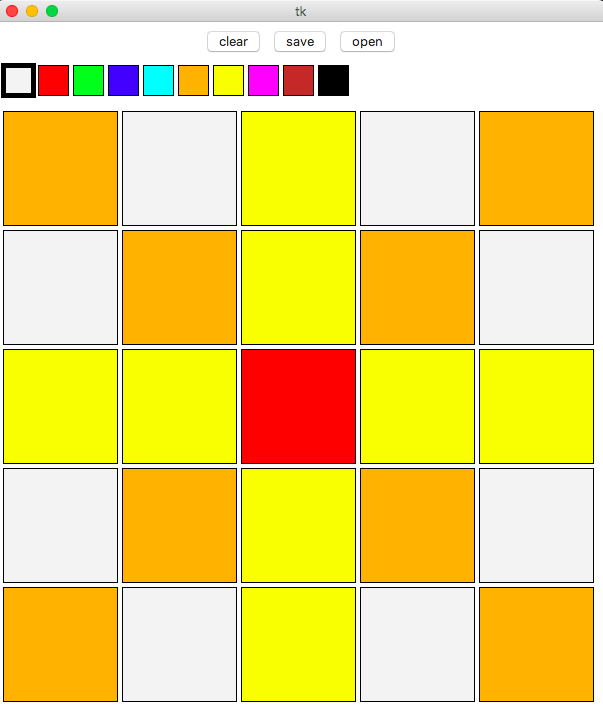

# colouring-grid

Just a simple Python app to try out the TkInter interface to the Tk GUI toolkit and to keep my children occupied. It shows a window with a square grid of cells which can be coloured by selecting from a palette. Run with

`python grid.py <n>`

where <n> is an optional integer (1 – 26) denoting the grid side length.

The grid can be saved as a list of the coordinates of the cells filled with each colour. An additional program generates an SVG image of a empty grid which can be patiently coloured in (in silence) by your grateful progeny.

`python make_grid.py <n>`

The window (on a Mac) looks like this:

and its output, when saved is:

    orange
    ------
    A1, A5, B2, B4, D2, D4, E1, E5

    red
    ---
    C3

    yellow
    ------
    A3, B3, C1, C2, C4, C5, D3, E3

More information is available on [the main scipython.com website page](https://scipython.com/blog/a-simple-colouring-grid/).
